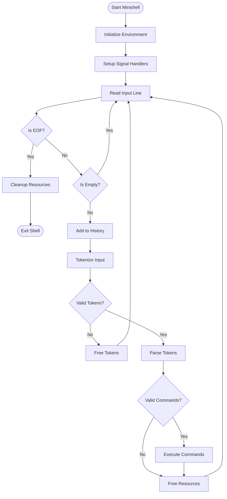
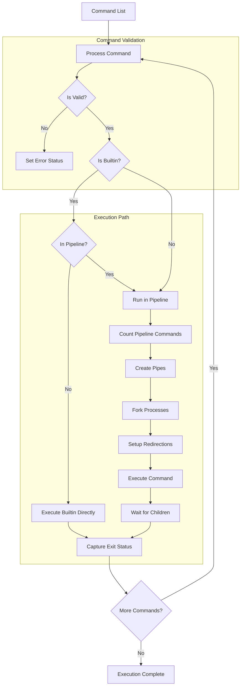
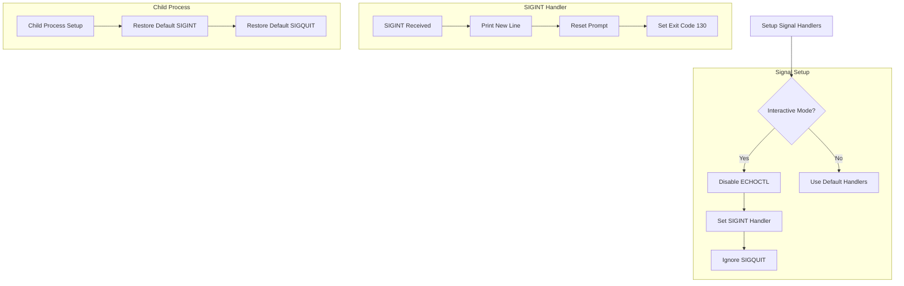
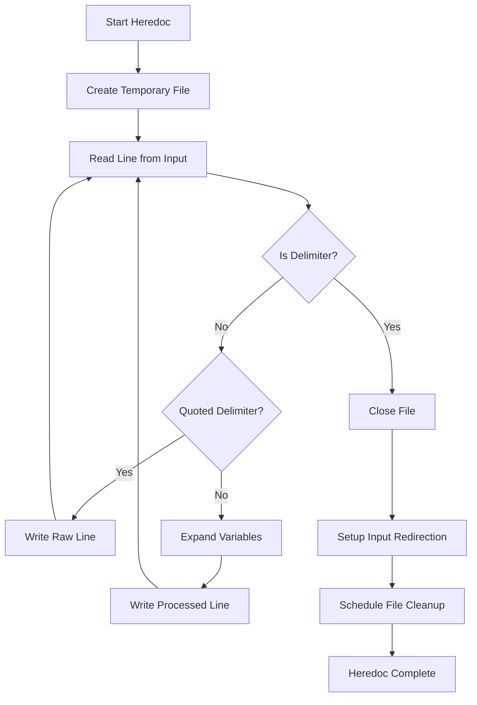
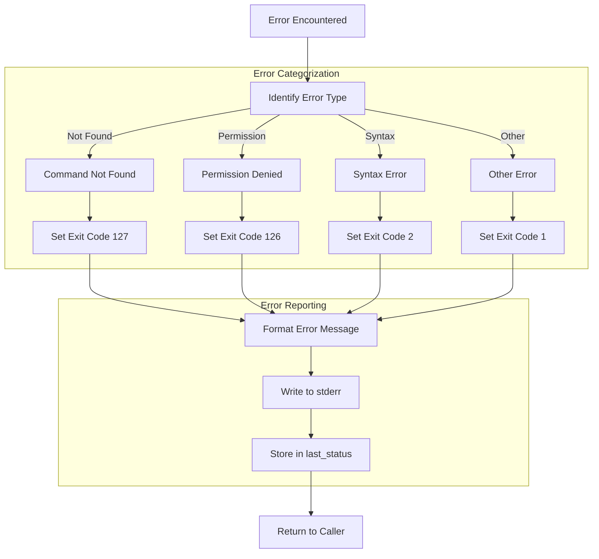
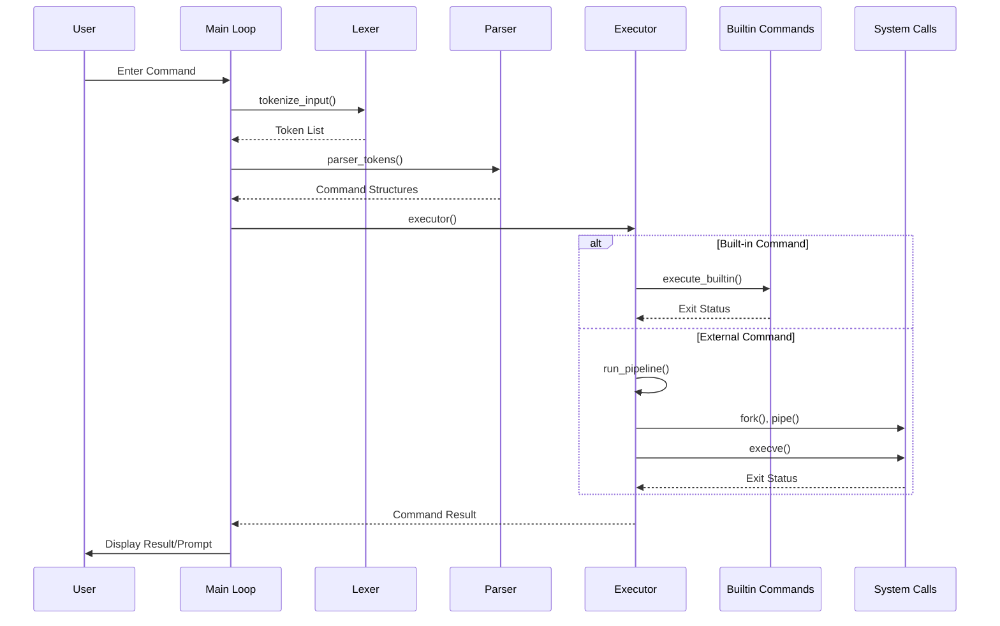

# Minishell Project Architecture Documentation

## Overview

Minishell is a simplified shell implementation similar to bash, providing core shell functionality including command execution, piping, redirections, environment variable management, and built-in commands. This document explains the architecture, components, and interaction flow of the project.

## Overall Flow Diagram



## Project Structure

The project is organized into distinct modules, each responsible for a specific aspect of shell functionality:

```
minishell/
├── include/                  # Header files
│   ├── builtins.h            # Built-in command declarations
│   ├── executor.h            # Command execution functionality
│   ├── lexer.h               # Lexical analysis
│   ├── minishell.h           # Main header file
│   ├── parser.h              # Parsing structures and functions
│   └── signals.h             # Signal handling
├── src/
│   ├── builtins/             # Built-in command implementations
│   ├── executor/             # Command execution code
│   ├── lexer/                # Tokenization and lexical analysis
│   ├── parser/               # Parsing of tokens into commands
│   └── signals/              # Signal handling for Ctrl+C, Ctrl+D
├── libft/                    # Custom library functions
├── Makefile                  # Build instructions
└── main.c                    # Entry point
```

## Core Components

### 1. Lexer & Tokenizer

**Purpose**: Break down input strings into meaningful tokens.

**Key Components**:
- **Fragment System**: A flexible approach for handling quotes and compound tokens
- **Token Types**: Words, pipes, redirections, etc.
- **Quote Handling**: Support for single, double, and mixed quotes

**Flow Diagram**:
```mermaid
flowchart TD
    Input[Input String] --> Fragments[Parse Into Fragments]
    Fragments --> ProcessFragments[Process Fragments]
    ProcessFragments --> TokenList[Create Token List]
    
    subgraph "Fragment Parsing"
        F1[Identify Text Type] --> |Quote| QuotedText[Handle Quoted Text]
        F1 --> |Operator| OperatorText[Handle Operators]
        F1 --> |Regular| PlainText[Handle Plain Text]
        QuotedText --> CreateFragment[Create Fragment Node]
        OperatorText --> CreateFragment
        PlainText --> CreateFragment
    end
    
    subgraph "Token Creation"
        T1[Analyze Fragment Type] --> |Word| WordToken[Create Word Token]
        T1 --> |Pipe| PipeToken[Create Pipe Token]
        T1 --> |Redirection| RedirToken[Create Redirection Token]
        WordToken --> LinkToken[Link to Token List]
        PipeToken --> LinkToken
        RedirToken --> LinkToken
    end

**Main Structures**:
```c
typedef enum e_token_type {
    TOKEN_WORD,          // normal word
    TOKEN_PIPE,          // pipe '|'
    TOKEN_REDIRECT_IN,   // <
    TOKEN_REDIRECT_OUT,  // >
    TOKEN_HEREDOC,       // <<
    TOKEN_APPEND,        // >>
    TOKEN_EOF,           // end of file
    TOKEN_IN_FILE,       // Input file
    TOKEN_OUT_FILE       // Output file
} t_token_type;

typedef enum e_quote_type {
    QUOTE_NONE,
    QUOTE_SINGLE,
    QUOTE_DOUBLE,
    QUOTE_MIXED
} t_quote_type;

typedef struct s_fragment {
    char *text;
    t_quote_type quote_type;
    struct s_fragment *next;
} t_fragment;

typedef struct s_token {
    t_token_type type;
    t_fragment *fragments;
    struct s_token *next;
} t_token;
```

**Flow**:
1. Input string is processed character by character
2. Fragments are created based on quotes and operators
3. Fragments are combined into tokens with specific types
4. Tokens are linked in a list representing the command line

### 2. Parser

**Purpose**: Convert tokens into an executable command structure.

**Key Components**:
- **Command Representation**: Structure to hold command arguments and redirections
- **Redirection Handling**: Parse input/output redirections
- **Pipeline Management**: Linking commands with pipes

**Flow Diagram**:
```mermaid
flowchart TD
    TokenList[Token List] --> ProcessTokens[Process Tokens]
    
    subgraph "Command Creation"
        ProcessTokens --> CreateCmd[Create Command Node]
        CreateCmd --> ParseArgs[Parse Arguments]
        CreateCmd --> ParseRedir[Parse Redirections]
        ParseArgs --> AddArguments[Add to argv Array]
        ParseRedir --> HandleRedir[Handle Redirection Types]
        HandleRedir --> |Input| InRedir[Input Redirection]
        HandleRedir --> |Output| OutRedir[Output Redirection]
        HandleRedir --> |Append| AppendRedir[Append Redirection]
        HandleRedir --> |Heredoc| HeredocRedir[Heredoc Redirection]
    end
    
    subgraph "Pipeline Building"
        CheckPipe{Is Pipe?} --> |Yes| SetPipeFlag[Set Pipe Flag]
        SetPipeFlag --> NextCmd[Move to Next Command]
        CheckPipe --> |No| CommandDone[Command Complete]
    end
    
    ProcessTokens --> CheckPipe

**Main Structures**:
```c
typedef struct s_redir {
    char *file;
    int type;
    bool quoted;
    struct s_redir *next;
} t_redir;

typedef struct s_cmd {
    char **argv;
    t_quote_type *argv_quote;
    t_redir *redirs;
    int pipe;
    struct s_cmd *next;
} t_cmd;
```

**Flow**:
1. Tokens are analyzed to create command structures
2. Arguments are collected until a pipe or redirection is encountered
3. Redirections are parsed and linked to the command
4. Commands are linked together to form a pipeline

### 3. Executor

**Purpose**: Execute the parsed commands with proper handling of redirections, pipes, and environment.

**Key Components**:
- **Built-in Command Handling**: Implementation of shell built-ins like cd, echo, etc.
- **Environment Management**: Functions to get, set, and manipulate environment variables
- **Redirection Handling**: Setup of file descriptors for input/output redirection
- **Pipeline Execution**: Creation and management of pipes between commands
- **Variable Expansion**: Expansion of environment variables in command arguments

**Flow Diagram**:


**Pipe Execution Detail**:
```mermaid
flowchart TD
    Start[Start Pipeline] --> CreatePipes[Create Necessary Pipes]
    CreatePipes --> AllocPids[Allocate PID Array]
    
    subgraph "For Each Command"
        Fork[Fork Process] --> IsChild{Is Child?}
        IsChild --> |Yes| SetupPipes[Setup Pipe FDs]
        SetupPipes --> CloseUnused[Close Unused Pipes]
        CloseUnused --> HandleRedirs[Handle Redirections]
        HandleRedirs --> IsBuiltin{Is Builtin?}
        IsBuiltin --> |Yes| RunBuiltin[Run Builtin]
        IsBuiltin --> |No| FindExec[Find Executable]
        FindExec --> Execve[Call execve]
        RunBuiltin --> Exit[Exit Child]
        Execve --> Exit
        
        IsChild --> |No| NextCmd[Move to Next Command]
    end
    
    AllocPids --> Fork
    NextCmd --> AllDone{All Done?}
    AllDone --> |No| Fork
    AllDone --> |Yes| CloseParentPipes[Close All Pipes]
    CloseParentPipes --> WaitChildren[Wait for Children]
    WaitChildren --> GetLastStatus[Get Last Command Status]
    GetLastStatus --> Cleanup[Clean Up Resources]
    Cleanup --> End[End Pipeline]

**Main Structures**:
```c
typedef struct s_exec_state {
    int last_status;
} t_exec_state;

typedef struct s_heredoc_args {
    int fd;
    const char *delimiter;
    bool quoted;
    char **envp;
    t_exec_state *state;
    char *heredoc_path;
} t_heredoc_args;
```

**Flow**:
1. Commands are analyzed for built-ins which may be executed directly
2. For external commands, fork() creates child processes
3. Redirections are set up in the child process
4. Pipes are established between commands if needed
5. Command is executed using execve()
6. Parent process waits for children to complete
7. Exit status is captured and stored

### 4. Built-in Commands

**Purpose**: Implement shell built-in commands that don't require external processes.

**Commands Implemented**:
- **echo**: Display a line of text
- **cd**: Change directory
- **pwd**: Print working directory
- **export**: Set environment variables
- **unset**: Remove environment variables
- **env**: Display environment
- **exit**: Exit the shell

### 5. Signal Handling

**Purpose**: Manage interrupts and terminal signals appropriately.

**Signals Handled**:
- **SIGINT (Ctrl+C)**: Interrupt current foreground process
- **SIGQUIT (Ctrl+\\)**: Ignored in interactive mode, causes core dump in child processes
- **EOF (Ctrl+D)**: Exit the shell

**Flow Diagram**:


## Special Features

### 1. Variable Expansion

**Implementation**:
- Expands $VARIABLES in command arguments
- Supports special variables like $? (last exit status)
- Handles variable expansion inside double quotes but not single quotes
- Special handling for ANSI-C quotes ($'string') and locale-specific quotes ($"string")

**Flow Diagram**:
```mermaid
flowchart TD
    Input[Input String] --> ProcessChar[Process Character]
    ProcessChar --> IsDollar{Is $?}
    
    IsDollar --> |Yes| CheckQuote{In Single Quote?}
    CheckQuote --> |Yes| AppendLiteral[Append Literal $]
    CheckQuote --> |No| CheckNext{What Follows?}
    
    CheckNext --> |?| ExpandExitStatus[Expand Exit Status]
    CheckNext --> |Variable Name| ExtractVar[Extract Variable Name]
    CheckNext --> |'| HandleAnsiC[Handle ANSI-C Quote]
    CheckNext --> |"| HandleLocale[Handle Locale Quote]
    
    ExtractVar --> LookupVar[Look Up in Environment]
    LookupVar --> AppendValue[Append Value]
    
    ExpandExitStatus --> ConvertStatus[Convert Status to String]
    ConvertStatus --> AppendValue
    
    HandleAnsiC --> ProcessEscapes[Process Escape Sequences]
    ProcessEscapes --> AppendValue
    
    HandleLocale --> TranslateString[Translate String]
    TranslateString --> AppendValue
    
    AppendLiteral --> NextChar[Move to Next Character]
    AppendValue --> NextChar
    
    IsDollar --> |No| AppendRegular[Append Regular Character]
    AppendRegular --> NextChar
    
    NextChar --> IsEnd{End of String?}
    IsEnd --> |No| ProcessChar
    IsEnd --> |Yes| ReturnResult[Return Expanded String]
```

### 2. Heredoc Implementation

**Flow**:
1. Temporary file is created for heredoc content
2. Shell reads input until delimiter is encountered
3. Content is written to the temporary file
4. File descriptor is set up for command input
5. Temporary file is unlinked after use

**Flow Diagram**:


### 3. Pipes

**Implementation**:
- Creates pipe() for each command connection
- Sets up file descriptors for reading/writing
- Closes unused file descriptors to prevent leaks
- Handles multi-command pipelines properly

**Flow Diagram**:
```mermaid
flowchart TD
    Start[Start Pipeline] --> CountCmds[Count Commands]
    CountCmds --> CalcPipes[Calculate Needed Pipes]
    CalcPipes --> CreatePipes[Create Pipe Arrays]
    
    subgraph "Pipe Creation"
        ForEachPipe[For Each Connection] --> CallPipe[Call pipe()]
        CallPipe --> StorePipe[Store File Descriptors]
        StorePipe --> NextPipe{More Pipes?}
        NextPipe --> |Yes| ForEachPipe
        NextPipe --> |No| PipesReady[Pipes Ready]
    end
    
    subgraph "Child Process"
        SetupChild[Child Process Setup] --> IsFirst{First Command?}
        IsFirst --> |No| SetupStdin[Set stdin from Previous Pipe]
        IsFirst --> |Yes| KeepStdin[Keep Original stdin]
        
        SetupStdin --> IsLast{Last Command?}
        KeepStdin --> IsLast
        IsLast --> |No| SetupStdout[Set stdout to Next Pipe]
        IsLast --> |Yes| KeepStdout[Keep Original stdout]
        
        SetupStdout --> CloseAllPipes[Close All Pipe FDs]
        KeepStdout --> CloseAllPipes
    end
    
    CreatePipes --> ForEachPipe
    PipesReady --> SetupChild
```

### 4. Error Handling and Exit Codes

**Strategy**:
- Commands return standard Unix exit codes
- Error messages are printed to stderr
- Last command exit status is stored for $? expansion
- Special handling for command not found (127), permission denied (126), etc.

**Flow Diagram**:


## Command Execution Flow



1. **Input Reading**:
   - Read input line using readline()
   - Add to history if non-empty
   
2. **Lexical Analysis**:
   - Tokenize input using the fragment-based lexer
   - Handle quotes and special characters
   
3. **Parsing**:
   - Convert tokens to command structures
   - Parse redirections and arguments
   
4. **Execution**:
   - Set up environment
   - Handle redirections
   - Create pipes if needed
   - Execute built-ins directly or fork for external commands
   
5. **Cleanup**:
   - Close file descriptors
   - Free allocated memory
   - Store command exit status

## Known Issues and Improvements

### Current Issues:
- Command output redirection appears to have issues in some contexts
- ANSI-C quoting ($'string') is not fully implemented
- Some complex variable expansions may not work as expected

### Potential Improvements:
- Enhanced error reporting with line numbers
- Support for command history navigation
- Tab completion for commands and filenames
- Support for more advanced features like command substitution
- Fix output handling for proper display of command results

## Conclusion

The Minishell project implements a basic shell with key features like command execution, piping, redirections, and environment handling. Its modular architecture makes it maintainable and extensible, with clear separation between lexical analysis, parsing, and execution phases.
