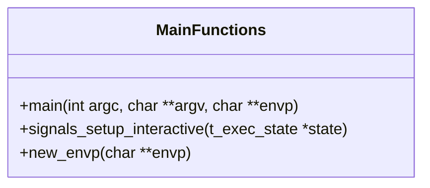
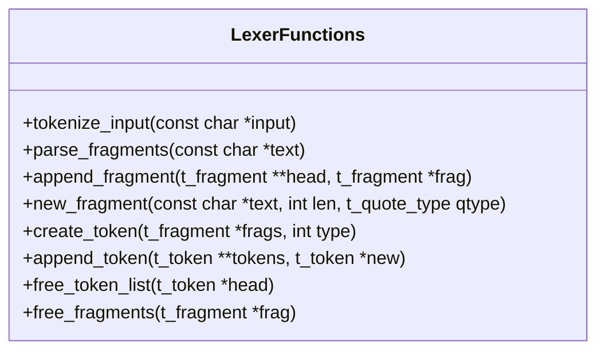
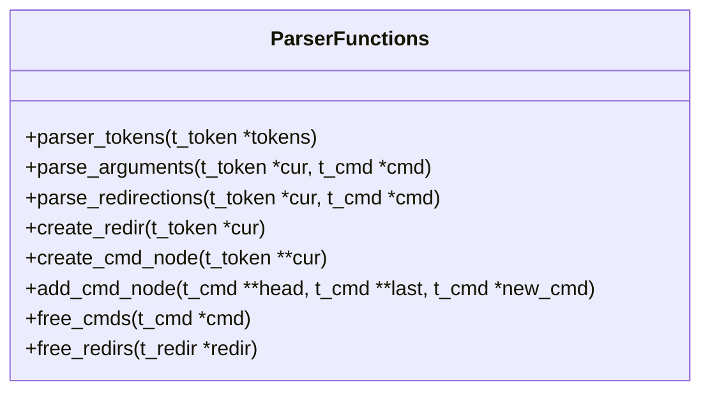
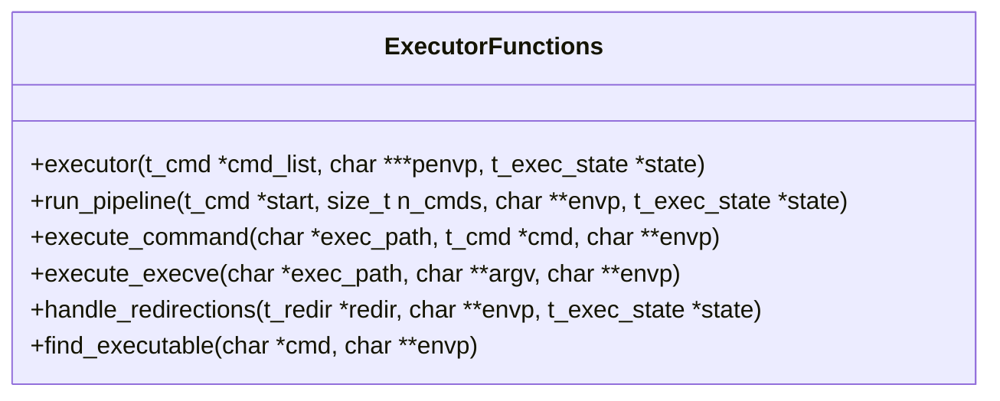
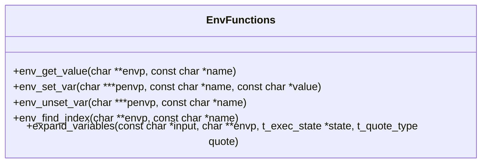
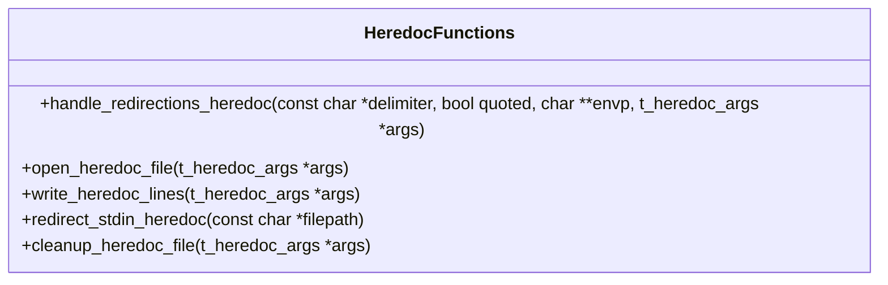
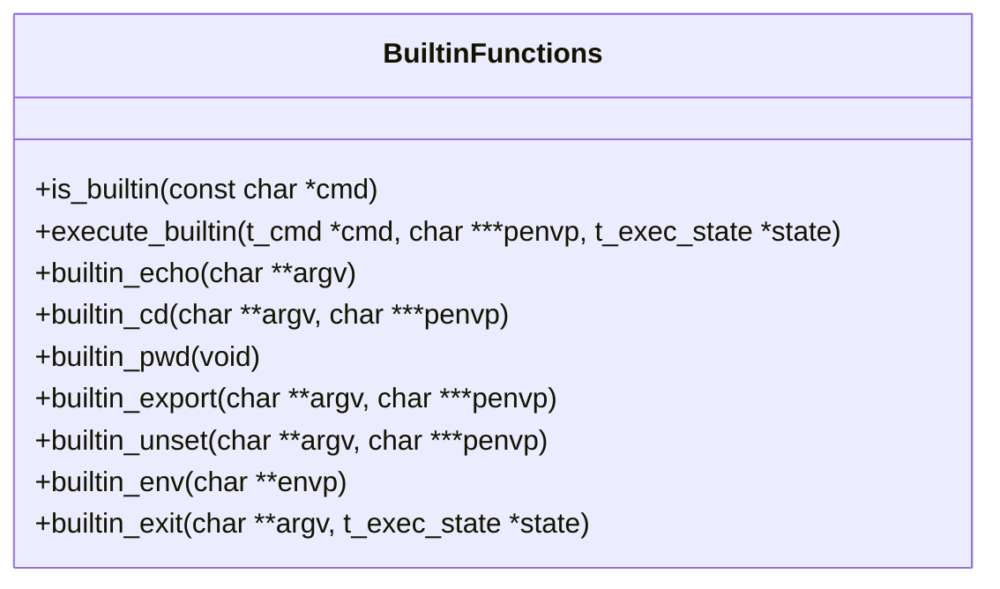
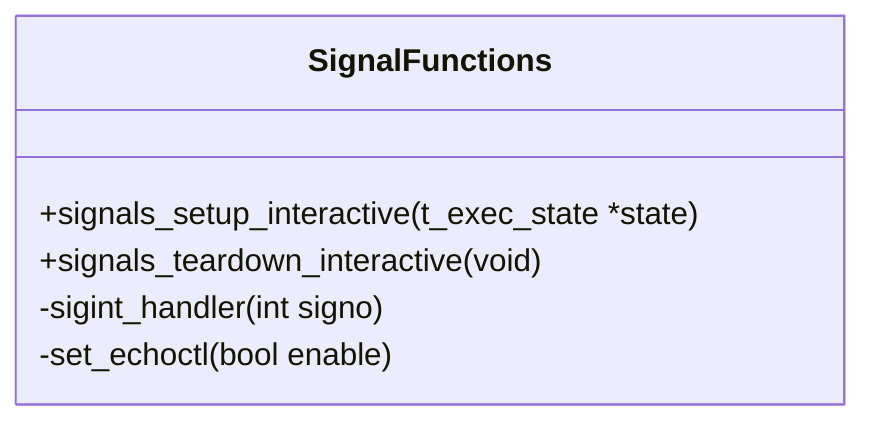

# Minishell Function Reference

This document provides a detailed reference of the key functions in each component of the Minishell project.

## Main Functions

| Function | Description | Parameters | Return Value |
|----------|-------------|------------|--------------|
| `main` | Entry point of the program, implements the shell's main loop | `argc`: Argument count `argv`: Argument vector `envp`: Environment variables | `int`: Exit status |
| `signals_setup_interactive` | Sets up signal handlers for interactive mode | `state`: Execution state | `void` |
| `new_envp` | Creates a copy of the environment variables | `envp`: Environment variables | `char **`: New environment |

## Lexer & Tokenizer Functions

| Function | Description | Parameters | Return Value |
|----------|-------------|------------|--------------|
| `tokenize_input` | Main lexer function that converts input string to token list | `input`: Input string | `t_token *`: List of tokens |
| `parse_fragments` | Breaks input into fragments based on quotes and special chars | `text`: Input text | `t_fragment *`: List of fragments |
| `append_fragment` | Adds a new fragment to the fragment list | `head`: Pointer to list head `frag`: Fragment to add | `void` |
| `new_fragment` | Creates a new fragment with the given text and quote type | `text`: Fragment text `len`: Text length `qtype`: Quote type | `t_fragment *`: New fragment |
| `create_token` | Creates a new token with the given fragments and type | `frags`: Token fragments `type`: Token type | `t_token *`: New token |
| `append_token` | Adds a new token to the token list | `tokens`: Pointer to list head `new`: Token to add | `void` |
| `free_token_list` | Frees all memory associated with a token list | `head`: List head | `void` |
| `free_fragments` | Frees all memory associated with a fragment list | `frag`: List head | `void` |

## Parser Functions

| Function | Description | Parameters | Return Value |
|----------|-------------|------------|--------------|
| `parser_tokens` | Main parser function that converts tokens to command structures | `tokens`: Token list | `t_cmd *`: Command list |
| `parse_arguments` | Extracts command arguments from tokens | `cur`: Current token `cmd`: Command to fill | `t_token *`: Next token to process |
| `parse_redirections` | Processes redirection tokens | `cur`: Current token `cmd`: Command to add redirections to | `t_token *`: Next token to process |
| `create_redir` | Creates a redirection structure | `cur`: Redirection token | `t_redir *`: New redirection |
| `create_cmd_node` | Creates a new command node | `cur`: Pointer to current token | `t_cmd *`: New command |
| `add_cmd_node` | Adds a command to the command list | `head`: List head `last`: Last node `new_cmd`: Command to add | `void` |
| `free_cmds` | Frees all memory associated with a command list | `cmd`: Command list | `void` |
| `free_redirs` | Frees all memory associated with a redirection list | `redir`: Redirection list | `void` |

## Executor Functions

| Function | Description | Parameters | Return Value |
|----------|-------------|------------|--------------|
| `executor` | Main executor function that handles command execution | `cmd_list`: Command list `penvp`: Pointer to environment `state`: Execution state | `void` |
| `run_pipeline` | Executes a pipeline of commands | `start`: First command `n_cmds`: Number of commands `envp`: Environment `state`: Execution state | `int`: Exit status |
| `execute_command` | Executes a single command | `exec_path`: Executable path `cmd`: Command to execute `envp`: Environment | `int`: Exit status |
| `execute_execve` | Calls execve with proper error handling | `exec_path`: Executable path `argv`: Command arguments `envp`: Environment | `int`: Exit status |
| `handle_redirections` | Sets up file redirections | `redir`: Redirection list `envp`: Environment `state`: Execution state | `int`: Error status |
| `find_executable` | Finds the path to an executable | `cmd`: Command name `envp`: Environment | `char *`: Executable path |

## Environment Variable Functions

| Function | Description | Parameters | Return Value |
|----------|-------------|------------|--------------|
| `env_get_value` | Gets the value of an environment variable | `envp`: Environment `name`: Variable name | `char *`: Variable value |
| `env_set_var` | Sets an environment variable | `penvp`: Pointer to environment `name`: Variable name `value`: Variable value | `int`: Success status |
| `env_unset_var` | Removes an environment variable | `penvp`: Pointer to environment `name`: Variable name | `int`: Success status |
| `env_find_index` | Finds the index of an environment variable | `envp`: Environment `name`: Variable name | `int`: Variable index |
| `expand_variables` | Expands variables in a string | `input`: Input string `envp`: Environment `state`: Execution state `quote`: Quote context | `char *`: Expanded string |

## Heredoc Functions

| Function | Description | Parameters | Return Value |
|----------|-------------|------------|--------------|
| `handle_redirections_heredoc` | Sets up a heredoc redirection | `delimiter`: Heredoc delimiter `quoted`: Whether delimiter is quoted `envp`: Environment `args`: Heredoc arguments | `int`: Success status |
| `open_heredoc_file` | Creates and opens a temporary file | `args`: Heredoc arguments | `int`: File descriptor |
| `write_heredoc_lines` | Reads lines until delimiter and writes to file | `args`: Heredoc arguments | `int`: Success status |
| `redirect_stdin_heredoc` | Redirects stdin from heredoc file | `filepath`: Path to heredoc file | `void` |
| `cleanup_heredoc_file` | Removes temporary heredoc file | `args`: Heredoc arguments | `void` |

## Built-in Command Functions

| Function | Description | Parameters | Return Value |
|----------|-------------|------------|--------------|
| `is_builtin` | Checks if a command is a built-in | `cmd`: Command name | `bool`: Is builtin |
| `execute_builtin` | Executes a built-in command | `cmd`: Command to execute `penvp`: Pointer to environment `state`: Execution state | `int`: Exit status |
| `builtin_echo` | Implements echo command | `argv`: Command arguments | `int`: Exit status |
| `builtin_cd` | Implements cd command | `argv`: Command arguments `penvp`: Pointer to environment | `int`: Exit status |
| `builtin_pwd` | Implements pwd command | None | `int`: Exit status |
| `builtin_export` | Implements export command | `argv`: Command arguments `penvp`: Pointer to environment | `int`: Exit status |
| `builtin_unset` | Implements unset command | `argv`: Command arguments `penvp`: Pointer to environment | `int`: Exit status |
| `builtin_env` | Implements env command | `envp`: Environment | `int`: Exit status |
| `builtin_exit` | Implements exit command | `argv`: Command arguments `state`: Execution state | `int`: Exit status |

## Signal Handling Functions

| Function | Description | Parameters | Return Value |
|----------|-------------|------------|--------------|
| `signals_setup_interactive` | Sets up signal handlers for interactive mode | `state`: Execution state | `void` |
| `signals_teardown_interactive` | Restores original signal handlers | None | `void` |
| `sigint_handler` | Handles SIGINT (Ctrl+C) | `signo`: Signal number | `void` |
| `set_echoctl` | Enables/disables control character echo | `enable`: Enable flag | `void` |
