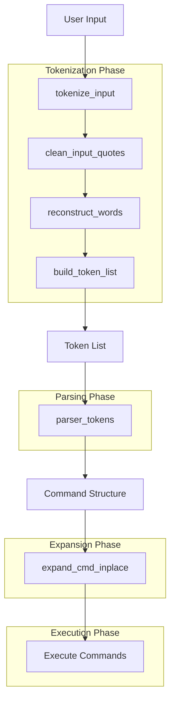
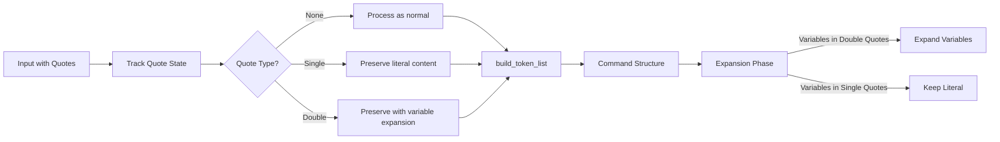
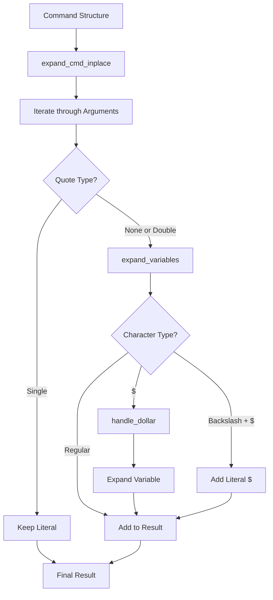
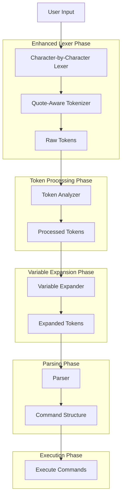
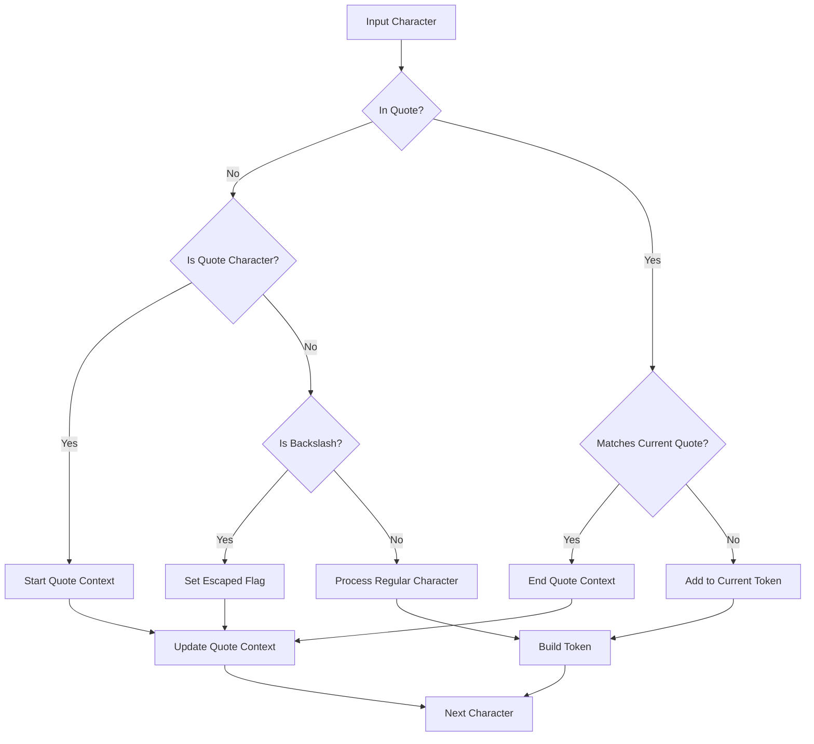
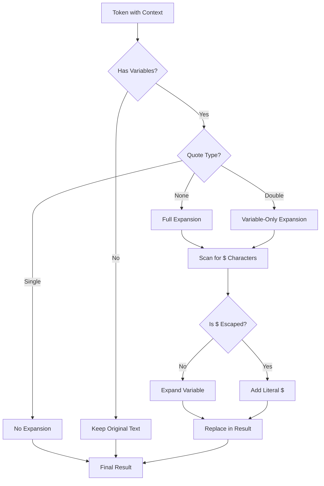

# Minishell Lexer and Tokenizer Architecture

This document provides a detailed analysis of the current lexer/tokenizer architecture and proposes an improved architecture for better handling of quotes, backslashes, and variable expansion.

## Current Architecture

The current implementation follows a multi-stage process for tokenization and command parsing.

### Current Flow Diagram



### Current Quote Handling Process



### Current Expansion Process



## Proposed Improved Architecture

The proposed architecture enhances the handling of quotes, backslashes, and variables with a more unified approach.

### Proposed Flow Diagram



### Proposed Quote Handling Process



### Proposed Expansion Process



## Unified Context Structure

The proposed architecture introduces a unified context structure to track the state during lexing and tokenization:

```c
typedef struct s_quote_context {
    t_quote_type current_quote;    // Current active quote (NONE, SINGLE, DOUBLE)
    bool         escaped;          // Is next character escaped by backslash
    bool         expand_variables; // Should variables be expanded in this context
} t_quote_context;
```

## Enhanced Token Structure

The tokens are enhanced with additional information to facilitate proper handling:

```c
typedef struct s_enhanced_token {
    char         *raw_text;        // Original unprocessed text
    char         *processed_text;  // Text after quote removal
    t_quote_type quote_type;       // Type of quote surrounding this token
    bool         has_variables;    // Does token contain expandable variables
    t_token_type type;             // Type of token (WORD, OPERATOR, etc.)
    struct s_enhanced_token *next; // Next token in the list
} t_enhanced_token;
```

## Rules for Special Character Handling

### Backslash Rules

1. **Outside quotes**:
   - Backslash escapes any following character
   - `\$` → literal `$`
   - `\\` → literal `\`
   - `\"` → literal `"`
   - `\'` → literal `'`

2. **Inside double quotes**:
   - Backslash only escapes `$`, `"`, `\`, and newline
   - `\$` → literal `$`
   - `\\` → literal `\`
   - `\"` → literal `"`
   - `\'` → `\'` (backslash + quote)

3. **Inside single quotes**:
   - Backslash has no special meaning
   - `\$` → `\$` (backslash + dollar)
   - `\\` → `\\` (two backslashes)
   - `\"` → `\"` (backslash + quote)

### Variable Expansion Rules

1. **Outside quotes**:
   - Variables are expanded
   - `$USER` → value of USER

2. **Inside double quotes**:
   - Variables are expanded
   - `"$USER"` → value of USER

3. **Inside single quotes**:
   - No variable expansion
   - `'$USER'` → literal `$USER`

## Comparison: Current vs. Proposed

| Aspect | Current Implementation | Proposed Implementation |
|--------|------------------------|-------------------------|
| Quote Handling | Spread across multiple phases | Unified context structure |
| Backslash Processing | Mixed in with variable expansion | Dedicated character processor |
| Variable Expansion | During execution phase | Separate dedicated phase |
| Token Information | Basic token types | Enhanced with quote context and expansion flags |
| Error Handling | Various locations | Centralized during tokenization |
| Complex Cases | Ad-hoc handling | Systematic rules-based approach |

## Implementation Strategy

1. Implement the `t_quote_context` structure
2. Create the character-by-character processor
3. Enhance the token structure
4. Update the variable expansion logic
5. Integrate the improved components into the existing codebase

By following this architecture, the minishell will have a more robust and maintainable approach to handling complex cases with quotes, backslashes, and variable expansions.
