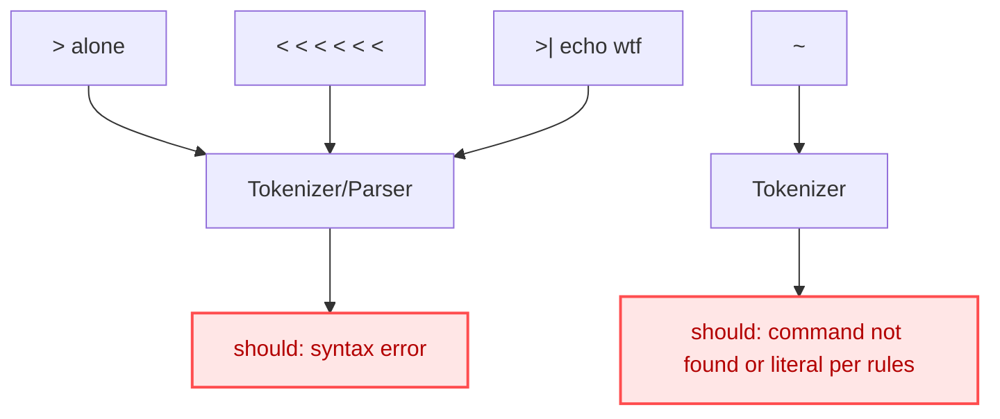
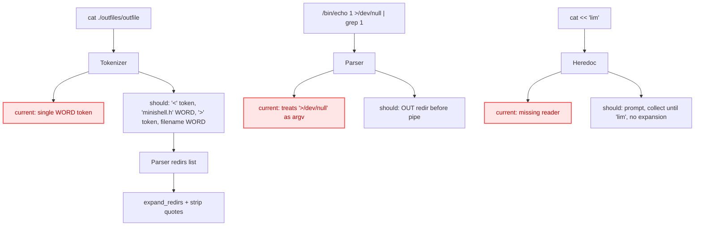
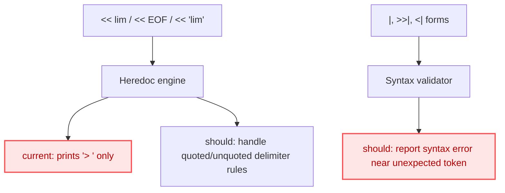

## Test Failures Diagrams (2025-08-28)

### File: STD_OUT_failures_20250828_174816.txt

Key categories: tilde expansion missing, `$` edge cases (`$"`, `$'`, trailing `$`), `$USER` not expanding in double quotes due to heuristic, backslash-before-dollar parity, quoting concatenations.

```mermaid
graph TD
  classDef err fill:#ffe6e6,stroke:#ff4d4f,stroke-width:2px,color:#b30000;
  classDef warn fill:#fff7e6,stroke:#fa8c16,stroke-width:1px,color:#8c4a00;

  A["echo cd ~"] --> B["Tokenizer"]
  B --> C["Token: ~ (WORD)"]
  C --> D["expand_argv"]
  D --> E["tilde expansion"]
  E --> F["/home/user"]
  class E err

  G["echo $\"HOME\"$USER"] --> H["expand_variables"]
  H --> I{"$ followed by quote?"}
  I -- "yes" --> J["current: literal $"]
  class J err
  I -- "should" --> K["disappear (empty)"]

  L["echo """"""""$USER""""""""] --> M["expand_variables in dquotes"]
  M --> N["$USER expands"]
  class N err

  O["echo \\...$USER"] --> P["backslash-dollar handling"]
  P --> Q["current: always literal $ (1-escape only)"]
  class Q err
  P --> R["required: parity of backslashes decides expansion vs literal"]
```

---

### File: STD_OUT_failures_20250828_175159.txt

Key categories: syntax error handling for standalone/sequence of operators, tilde token as invalid command, pipeline edge cases, heredoc/append syntax forms.



---

### File: STD_OUT_failures_20250828_175330.txt

Key categories: redirection parsing with no spaces (operator adjacency), quote stripping for filenames, proper pipe behavior with redirections, heredoc behavior (quoted delimiters), printing of arguments mistakenly including redirs.



---

### File: STD_OUT_failures_20250828_175708.txt

Key categories: similar syntax error cases as previous, additional heredoc lines showing lack of implementation.




